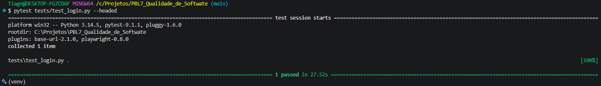

# 🧩 Atividade PBL – Aula 10  
## Testes Funcionais Automatizados – LocalEats

---

## 👥 Integrante
- Tiago Jesus Pereira

---

## 🔹 1. Fluxo funcional escolhido

### 📌 Fluxo:
Login de usuário

🔎 **Descrição** Permite autenticar um usuário no sistema preenchendo e-mail e senha na interface, com redirecionamento para o dashboard principal.

🎯 **Importância** É o fluxo mais crítico do sistema (End-to-End). Se o login quebrar em produção, o usuário não consegue acessar nenhuma outra funcionalidade protegida (como histórico de pedidos, favoritos ou checkout).

---

## 🔹 2. Teste com Codegen

### 💻 Comando utilizado

```bash
playwright codegen [https://local-eats-unisenac.vercel.app/](https://local-eats-unisenac.vercel.app/) -o tests/codegen_login.py
```

### 🔗 Link para o código gerado

👉 https://github.com/T1P3R31R4/PBL7e8_Qualidade_de_Softwate/blob/main/tests/codegen_login.py

### 🧠 Observações

- O Codegen foi uma boa ferramenta para descobrir rapidamente os seletores iniciais da página gerada.  
- Porém, o código gerado cru é falho em aplicações dinâmicas. Ele gravou um clique inicial na aba "Login" que se tornou obsoleto, pois a aplicação da Vercel possui um redirecionamento automático caso não haja sessão ativa.  
- Sem refatoração humana, o script gerado vira um "código espaguete" inviável de manter se a interface mudar.  

---

## 🔹 3. Teste automatizado com Pytest

### 🔗 Link para o teste

👉 https://github.com/T1P3R31R4/PBL7e8_Qualidade_de_Softwate/blob/main/tests/test_login.py

### 📌 O que o teste faz?

- Instancia a página no navegador utilizando a classe Page Object.  
- Navega até a URL base do LocalEats.  
- Preenche as credenciais reais do usuário utilizando a busca por `placeholder` (garantindo foco na acessibilidade).  
- Realiza um `assert` validando se a aba "Explorar" do dashboard de usuário logado ficou visível na tela.  

---

## 🔹 4. Refatoração com Page Object Model (POM)

### 🔗 Link para Page Object

👉 https://github.com/T1P3R31R4/PBL7e8_Qualidade_de_Softwate/blob/main/pages/login_page.py

### 🔗 Link para teste refatorado

👉 https://github.com/T1P3R31R4/PBL7e8_Qualidade_de_Softwate/blob/main/tests/test_login.py

### 🧠 Melhorias realizadas

- **Separação de Responsabilidades:** A lógica de encontrar botões e interagir com o DOM foi totalmente isolada no arquivo `login_page.py`. O `test_login.py` agora contém apenas a regra de negócio do teste.  
- **Resolução de Strict Mode:** O código do Codegen tentou clicar em "Entrar", mas a tela possuía dois botões com esse nome (a aba superior e o botão do formulário). Refatorei o POM para especificar o escopo com `.locator("#loginForm").get_by_role("button", name="Entrar")`, eliminando a ambiguidade.  
- **Sincronia de Rede (Paciência do Robô):** Inseri o método `.wait_for()` antes do Assert final para garantir que o Playwright aguarde o tempo de requisição do backend antes de validar a mudança de tela, evitando falsos negativos (`AssertionError: False == True`).  

---

## 🔹 5. Execução dos testes

### ▶️ Comando

```bash
pytest tests/test_login.py --headed
```

### 📊 Resultado

- Total de testes: 1  
- Testes passaram: 1  
- Testes falharam: 0  

### 📸 Evidência



---

## 🔹 6. Análise crítica dos testes

- **Quebras Iniciais:** O teste quebrou algumas vezes durante o desenvolvimento. Primeiro por um `TimeoutError` (procurando um botão inalcançável devido ao redirecionamento automático da página) e depois por um `strict mode violation` (o framework encontrou dois botões chamados "Entrar" e não sabia qual clicar).  
- **Seletores:** Utilizar atributos visuais como `get_by_placeholder` ou `get_by_role` se mostrou muito superior a depender de classes CSS (`.btn-primary`). Isso blinda o teste contra mudanças visuais e foca na usabilidade real.  
- **Codegen:** Ajuda a dar o pontapé inicial, mas está longe de ser a solução final. Depender apenas do Codegen gera testes extremamente frágeis e uma dívida técnica imensa a longo prazo.  

---

## 🔹 7. Reflexão no contexto do LocalEats

### Testes automatizados substituem testes manuais?
Não. O teste automatizado só verifica os cenários "felizes" e os erros que eu já previ e programei. O teste exploratório manual ainda é vital para encontrar problemas de layout, usabilidade e fluxos que o robô ignora por ser muito rápido.

### Vale a pena automatizar todos os fluxos?
Definitivamente não. O custo de criação e manutenção é alto (como percebido ao lidar com sincronia de requisições e seletores ambíguos). O foco deve ser na Curva de Pareto: automatizar os fluxos críticos e vitais (Login, Adicionar ao Carrinho, Pagamento), que representam o núcleo funcional da aplicação.

### Como isso ajuda no projeto do grupo?
Nessa reta final de curso, ter esse E2E (End-to-End) rodando no nosso projeto LocalEats tira aquele frio na barriga na hora de fazer um *deploy* na Vercel. Saber que os fluxos principais estão testados de ponta a ponta nos dá uma confiança muito maior para apresentar o sistema e garantir que o cliente sempre consiga logar com sucesso.