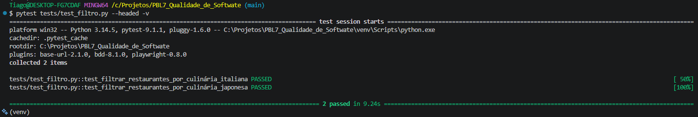

# Aula 12 – BDD e Automação Orientada a Comportamento
# Entrega PBL – LocalEats

## 👥 Integrante

- Tiago Jesus Pereira

---

# 🔹 1. Fluxo escolhido

## Integrante: Tiago Jesus Pereira

### Fluxo
Filtro por categoria

### Objetivo
Validar se o sistema consegue filtrar e exibir corretamente os restaurantes com base na categoria gastronômica selecionada pelo usuário (ex: Italiana, Japonesa).

### 🔗 Link para o projeto

👉 https://github.com/T1P3R31R4/PBL7e8_Qualidade_de_Softwate

---

# 🔹 2. Cenários BDD

## Arquivo

~~~text
features/filtro_categoria.feature
~~~

## Conteúdo

~~~gherkin
Feature: Filtro por categoria
  Como um usuário faminto
  Quero poder filtrar os restaurantes por categoria
  Para encontrar rapidamente o tipo de comida que desejo

  Scenario: Filtrar restaurantes por culinária Italiana
    Given que o usuário acessa a página inicial do LocalEats
    When o usuário clica na categoria Italiana
    Then o sistema deve exibir opções relacionadas a comida Italiana

  Scenario: Filtrar restaurantes por culinária Japonesa
    Given que o usuário acessa a página inicial do LocalEats
    When o usuário clica na categoria Japonesa
    Then o sistema deve exibir opções relacionadas a comida Japonesa
~~~

---

# 🔹 3. Automação com pytest-bdd

## Estrutura do projeto

~~~text
projeto/
│
├── features/
│   └── filtro_categoria.feature
│
├── tests/
│   └── test_filtro.py
│
└── evidencias/
    └── execucao_bdd.png

~~~

---

## Arquivo

~~~text
tests/test_filtro.py
~~~

## Código

~~~python
import pytest
from pytest_bdd import scenarios, given, when, then

scenarios('../features/filtro_categoria.feature')

@given('que o usuário acessa a página inicial do LocalEats')
def acessar_pagina_inicial(page):
    page.goto('[https://local-eats-unisenac.vercel.app/](https://local-eats-unisenac.vercel.app/)')
    
    # Faz o login automaticamente para evitar o redirecionamento
    page.get_by_placeholder("teste@teste.com").fill("SEU_EMAIL")
    page.get_by_placeholder("Sua senha secreta").fill("SUA_SENHA")
    page.locator("#loginForm").get_by_role("button", name="Entrar").click()
    
    # Aguarda o título principal carregar
    page.get_by_text("Descubra sabores incríveis").wait_for()

@when('o usuário clica na categoria Italiana')
def clicar_categoria_italiana(page):
    page.get_by_role('button', name='Italiana').click()

@then('o sistema deve exibir opções relacionadas a comida Italiana')
def validar_restaurantes_italianos(page):
    assert page.get_by_text("Italiana").first.is_visible()

@when('o usuário clica na categoria Japonesa')
def clicar_categoria_japonesa(page):
    page.get_by_role('button', name='Japonesa').click()

@then('o sistema deve exibir opções relacionadas a comida Japonesa')
def validar_restaurantes_japoneses(page):
    assert page.get_by_text("Japonesa").first.is_visible()
~~~

---

# 🔹 4. Execução dos testes

## Comando executado

~~~bash
pytest tests/test_filtro.py -v
~~~

---

## Resultado

~~~text
=================== test session starts ===================
collected 2 items                                                                                                                                                       

tests\test_filtro.py::test_filtrar_restaurantes_por_culinaria_italiana PASSED [ 50%]
tests\test_filtro.py::test_filtrar_restaurantes_por_culinaria_japonesa PASSED [100%]

==================== 2 passed in 6.45s ====================
~~~

---

# 🔹 5. Evidências

## Print da execução

---

# 🔹 6. Análise crítica

## O cenário ficou legível?
Completamente. A linguagem Gherkin remove todo o "tecniquês". Qualquer analista de negócios ou cliente final consegue ler o arquivo `.feature` e entender o que o sistema deve fazer sem precisar saber o que é um `locator` ou um `assert`.

## O BDD ajudou a entender o comportamento?
Sim. Antes de escrever qualquer linha de código em Python, o BDD me forçou a pensar: "Qual é o valor que essa funcionalidade entrega para o usuário?". O comportamento virou a prioridade, e a automação virou apenas uma ferramenta para provar que ele funciona.

## Quais dificuldades surgiram?
A maior dificuldade é fazer a "cola" exata entre a frase escrita no Gherkin e a declaração do decorador no Python (ex: `@given('texto exato')`). Se tiver uma letra minúscula diferente, o `pytest-bdd` não encontra o step e o teste quebra. Além disso, lidar com o redirecionamento automático da página de login exigiu injetar uma etapa de autenticação diretamente no `given`.

## O teste ficou dependente da interface?
Ficou bastante dependente. Apesar de o arquivo Gherkin ser imune a mudanças visuais, os steps no Python dependem dos textos e botões (`get_by_role`). Se o designer alterar o nome da categoria de "Italiana" para "Massas", o arquivo Python vai precisar de manutenção.

---

# 🔹 7. Reflexão final

## BDD melhora comunicação entre equipe?
Sim, cria uma "linguagem ubíqua" (comum a todos). O desenvolvedor sabe o que codar, o QA sabe o que testar, e o cliente sabe o que vai receber, tudo baseado no mesmo documento de texto.

## Todo teste deve usar BDD?
Não. Seria um desperdício de tempo usar BDD para testar cálculos matemáticos internos ou validações puras de banco de dados (que são melhor cobertas pelo TDD unitário). O BDD brilha em fluxos de jornada do usuário.

## Quando vale a pena usar BDD?
Quando estamos desenvolvendo regras de negócio centrais, onde a ambiguidade pode gerar prejuízos financeiros ou falhas críticas de experiência. Ajuda muito em projetos onde os requisitos mudam constantemente.

## Como isso ajuda no projeto do grupo?
Ajuda na criação de uma "Documentação Viva". Em vez de termos um PDF de requisitos morto e desatualizado, o próprio teste automatizado funciona como o manual do sistema.