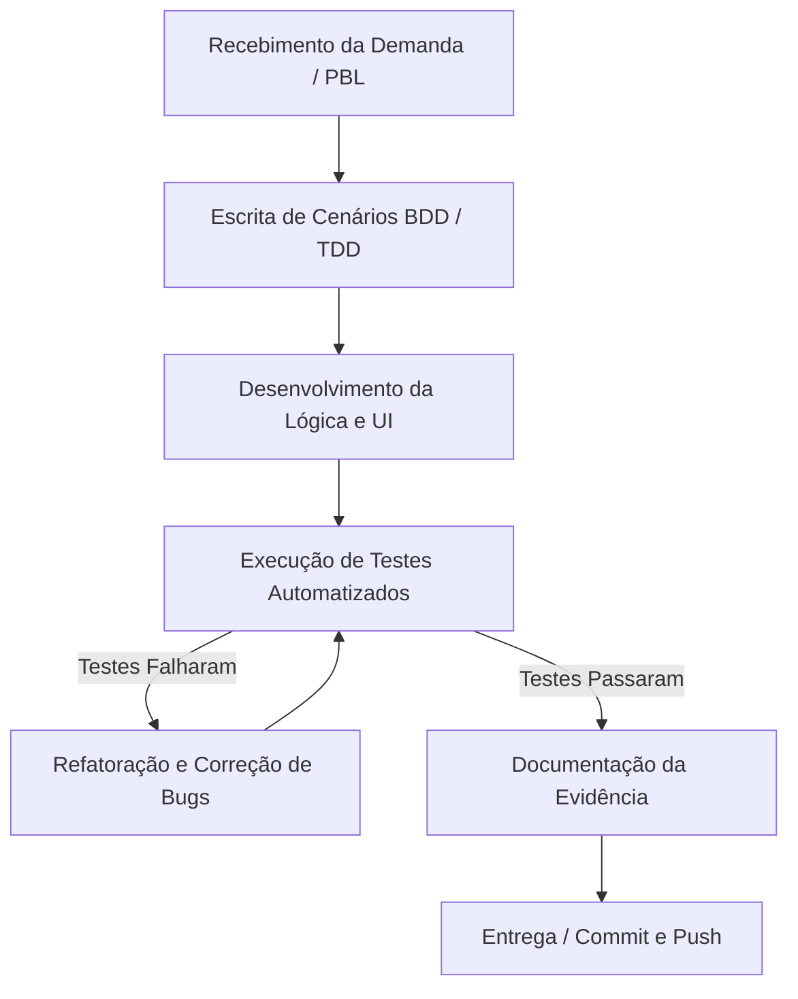

# Aula 14 - Qualidade de Processo
# Entrega PBL – LocalEats

## 👥 Integrante

- Tiago Jesus Pereira

---

## 🔹 1. Mapeamento do Processo

Como estou desenvolvendo este projeto de forma individual, o fluxo de trabalho foi adaptado para garantir que a qualidade não se perca na ausência de revisões por pares (Code Review). O fluxo atual integra as práticas de TDD e BDD adotadas nas últimas entregas.

### Fluxograma do Processo Atual

---

## 🔹 2. Entradas, Atividades e Saídas

O processo foi dividido em etapas claras, desde a compreensão do requisito até a entrega no repositório.

| Etapa | Entrada | Atividade | Saída |
|---------|---------|---------|---------|
| **1. Planejamento** | Documento do PBL / Requisito do sistema | Leitura e mapeamento de regras de negócio em Gherkin. | Cenários `.feature` e casos de teste descritos. |
| **2. Desenvolvimento (Red/Green)** | Casos de teste estruturados | Codificação inicial focada em fazer o teste automatizado passar (Pytest/Playwright). | Código-fonte (backend/frontend) funcional e script de teste inicial. |
| **3. Testes Automatizados** | Código-fonte e scripts de teste | Execução da suíte de testes unitários e funcionais localmente. | Log de resultados (Pass/Fail) no terminal. |
| **4. Refatoração e Correções** | Erros de timeout ou seletores frágeis (Falhas) | Ajustes no código e aplicação de Page Object Model (POM) para melhorar a estrutura. | Código limpo e testes resilientes (sem falsos negativos). |
| **5. Documentação** | Código validado e terminal verdinho | Captura de evidências visuais e elaboração da reflexão crítica. | Arquivo Markdown e imagens de evidência prontos. |
| **6. Entrega** | Arquivos finais do projeto | Versionamento, commit semântico e push para o GitHub. | Funcionalidade entregue e versionada na branch main. |

---

## 🔹 3. Reflexão sobre o Processo

### 1. O processo utilizado pela equipe está claramente definido?
Como atuo sozinho neste projeto, o processo começou de forma mais empírica e mental, mas foi se definindo e formalizando obrigatoriamente à medida que introduzi práticas como TDD e BDD. Hoje, a ordem de "testar antes de codar" força o processo a ser seguido de forma estruturada, evitando pular etapas de validação.

### 2. Todos os integrantes seguem o mesmo fluxo de trabalho?
Sendo um projeto individual, o fluxo é padronizado por natureza. No entanto, exigiu uma disciplina pessoal maior para não cair na armadilha de "codificar direto para ver funcionando", que é o padrão de desenvolvimento quando não há uma equipe cobrando o cumprimento do processo.

### 3. Em quais etapas a qualidade é verificada?
Com a adoção do BDD e TDD, a qualidade deixou de ser verificada apenas no fim da linha. Ela agora é verificada na **Etapa 1 (Planejamento)**, ao pensar no comportamento do usuário, e na **Etapa 3 (Testes)**, onde a execução automatizada garante que as regras de negócio e a interface não sofreram regressões.

### 4. Quais melhorias poderiam tornar o processo mais eficiente?
O próximo passo natural para amadurecer este processo seria implementar **Integração Contínua (CI)**, como o *GitHub Actions*. Dessa forma, a execução do Pytest ocorreria de forma automática em nuvem toda vez que eu fizesse um push, impedindo que código quebrado fosse mesclado ao repositório por acidente.

### 5. Como a qualidade do processo impacta a qualidade do produto final?
Um processo maduro muda o foco de "encontrar defeitos" para "prevenir defeitos". Nas últimas atividades, percebi que a falha não estava no sistema, mas na velocidade de sincronia da rede (robô rápido, internet lenta). Ter um processo que engloba a refatoração e a aplicação de Page Object Model (POM) me forçou a estruturar um código mais limpo. O reflexo direto disso no produto final é um sistema altamente testável, escalável e pronto para ir para produção na Vercel com muito mais confiança.